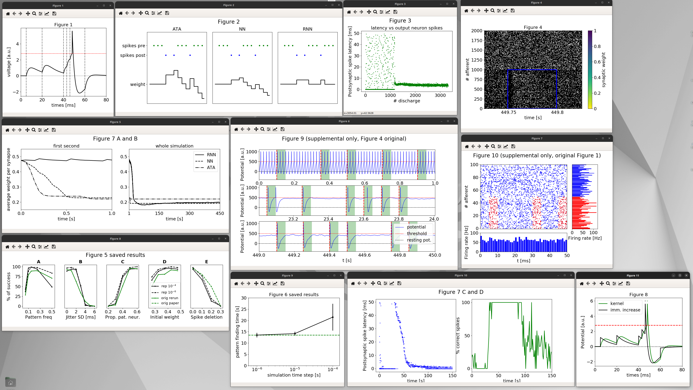

---
output:
  pdf_document:
    toc: false
    includes:
       in_header: codecheck-preamble.sty
    latex_engine: xelatex
---

```{r rsetup,eval=TRUE,include=FALSE}
require("codecheck")
require("knitr")
require("rprojroot")
require("yaml")
require("xtable")
require("tibble")
require("readr")
options(width = 60)
opts_chunk$set(cache = FALSE)

root <- find_root("codecheck.yml")
```

```{r codecheck_logo, echo=FALSE,results='asis'}
latex_codecheck_logo()
```

```{r manifest, eval=TRUE, include=FALSE}
metadata <- codecheck_metadata(root)
manifest <- metadata$manifest

dest_dir <- file.path(root, "codecheck", "outputs")
## Create the outputs directory if missing
if (!dir.exists(dest_dir) ) {
  dir.create(dest_dir)
}

# manual copy because of the timestamp in the filenames
#manifest_df <- copy_manifest_files(root, metadata,
#                                  dest_dir, keep_full_path = FALSE,
#                                  overwrite = FALSE
#                                  )
manifest_df <- list_manifest_files(root, metadata, dest_dir)
```

---
title: `r paste("CODECHECK certificate", metadata$certificate)`
subtitle: `r codecheck:::as_latex_url(metadata$report)`
---

```{r summary_metadata, echo=FALSE, results='asis'}
latex_summary_of_metadata(metadata)
```

```{r summary_manifest, echo=FALSE, results='asis'}
latex_summary_of_manifest(metadata, manifest_df, root)
```

\clearpage

# CODECHECKER notes

```{r git_sha, echo=FALSE}
gitInfo <- ""
if(git2r::in_repository(root)) {
  gitInfo <- paste0("This check is based on the commit `", git2r::last_commit()$sha, "`.")
}
```

This check is an execution of a computational workflow created in the context of a ReScience article (<https://rescience.github.io/bibliography/hathway_2018.html>, <https://doi.org/10.5281/zenodo.1327348>).
It adds another layer of confirmation to the applaudable efforts of a reference impleementation for the original research article (<https://doi.org/10.1371/journal.pone.0001377>).
The GitHub repo <https://github.com/codecheckers/Hathway-Goodman-2018> was forked from the original repository a while back and the check has been taken up by a new codechecker now.
`r gitInfo`

The repository contains a short README following the ReScience template.
Code was written in Python.
I went through the following steps based on the extensive instructions in `code/README.md` based on the section **"Quick running of the code"**.

```bash
conda update conda

cd code
conda env create -f environment.yml
```

```
LibMambaUnsatisfiableError: Encountered problems while solving:
  - nothing provides bsddb needed by brian2-2.1.2-np113py27h568d706_0
```

I'm now trying brian2 without version `2.2.1` because it is pretty close and available at https://anaconda.org/conda-forge/brian2/labels.
However, the channel `brian-team` does not exist anymore: <https://conda.anaconda.org/brian-team> linked from <https://brian2.readthedocs.io/en/2.1.1/introduction/install.html> gives a error message "page does not exist".
Therefore, I removed all pinned versions except for Python and the main library, which could finally be resolved by conda:

```yml
dependencies:
  - brian2=2.*
  - matplotlib
  - numba
  - numpy
  - python=3.6.5
```

```bash
conda activate HathwayGoodman
```

As suggested in the README, I ran the following command to generate most figures but reusing some data:

```bash
python main.py
```

The code completed without any errors but included a few (deprecation) warnings and library errors, the log output was as below:

\tiny

```
14:43 Preparing Figure 1: Potentials                                                                                                                                           
WARNING    /home/daniel/miniconda3/envs/HathwayGoodman/lib/python3.6/site-packages/sympy/matrices/matrices.py:1391: SymPyDeprecationWarning:                                   
                                                                                                                                                                               
Dot product of non row/column vectors has been deprecated since SymPy                                                                                                          
1.2. Use * to take matrix products instead. See                                                                                                                                
https://github.com/sympy/sympy/issues/13815 for more info.                                                                                                                     
                                                                                                                                                                               
  useinstead="* to take matrix products").warn()                                                                                                                               
 [py.warnings]                                                                                                                                                                 
14:44 Preparing Figure 2: STDP rules                                                                                                                                           
WARNING    /home/daniel/miniconda3/envs/HathwayGoodman/lib/python3.6/site-packages/sympy/matrices/matrices.py:1391: SymPyDeprecationWarning:                                   
                                                                                                                                                                               
Dot product of non row/column vectors has been deprecated since SymPy                                                                                                          
1.2. Use * to take matrix products instead. See                                                                                                                                
https://github.com/sympy/sympy/issues/13815 for more info.                                                                                                                     
                                                                                                                                                                               
  useinstead="* to take matrix products").warn()                                                                                                                               
 [py.warnings]                                                                                                                                                                 
14:44 Preparing Figures 3, 4, 7AB                                                                                                                                              
14:44 Preparing Figure 3 and 4 and 7AB: latency and convergence and weights                                                                                                    
    #### Simulation parameters:                                                                                                                                                
    random seed =             1                                                                                                                                                
    dt =                      100. us                                                                                                                                          
    initial weight =          0.475                                                                                                                                            
    jitter (SD) =             1                                                                                                                                                
    % of neurons in pattern = 50.0                                                                                                                                             
    pattern freq =            0.25                                                                                                                                             
    % spikes deleted =        0
    #### Creating input
    #### Simulation (ca. 150s)
WARNING    /home/daniel/miniconda3/envs/HathwayGoodman/lib/python3.6/site-packages/sympy/matrices/matrices.py:1391: SymPyDeprecationWarning: 

Dot product of non row/column vectors has been deprecated since SymPy
1.2. Use * to take matrix products instead. See
https://github.com/sympy/sympy/issues/13815 for more info.

  useinstead="* to take matrix products").warn()
 [py.warnings]
Number of spikes: 57643428
Number of spikes: 3318
Number of spikes: 21
Number of spikes: 10
Number of synapses: 2000
Number of synapses: 2000
Number of synapses: 2000
Number of synapses: 2000
Number of synapses: 2000
Number of synapses: 2000
Number of synapses: 2000
    #### Results
    Avg latency               =  3.757
    Hit rate (>98)            =  1.0
    Number false alarms (!=0) =  0
    Success                   =  1
    find_t                    =  23.26
    find_spike                =  1176
    #### Make figures
14:49 Preparing Figure 5: Robustness
WARNING    /home/daniel/git/codecheck/Hathway-Goodman-2018/code/figure_5.py:65: MatplotlibDeprecationWarning: Adding an axes using the same arguments as a previous axes currently reuses the earlier instance.  In a future version, a new instance will always be created and returned.  Meanwhile, this warning can be suppressed, and the future behavior ensured, by passing a unique label to each axes instance.
  subplot(1, 5, 1)
 [py.warnings]
WARNING    /home/daniel/git/codecheck/Hathway-Goodman-2018/code/figure_5.py:68: MatplotlibDeprecationWarning: Adding an axes using the same arguments as a previous axes currently reuses the earlier instance.  In a future version, a new instance will always be created and returned.  Meanwhile, this warning can be suppressed, and the future behavior ensured, by passing a unique label to each axes instance.
  subplot(1, 5, 2)
 [py.warnings]
WARNING    /home/daniel/git/codecheck/Hathway-Goodman-2018/code/figure_5.py:71: MatplotlibDeprecationWarning: Adding an axes using the same arguments as a previous axes currently reuses the earlier instance.  In a future version, a new instance will always be created and returned.  Meanwhile, this warning can be suppressed, and the future behavior ensured, by passing a unique label to each axes instance.
  subplot(1, 5, 3)
 [py.warnings]
WARNING    /home/daniel/git/codecheck/Hathway-Goodman-2018/code/figure_5.py:74: MatplotlibDeprecationWarning: Adding an axes using the same arguments as a previous axes currently reuses the earlier instance.  In a future version, a new instance will always be created and returned.  Meanwhile, this warning can be suppressed, and the future behavior ensured, by passing a unique label to each axes instance.
  subplot(1, 5, 4)
 [py.warnings]
WARNING    /home/daniel/git/codecheck/Hathway-Goodman-2018/code/figure_5.py:77: MatplotlibDeprecationWarning: Adding an axes using the same arguments as a previous axes currently reuses the earlier instance.  In a future version, a new instance will always be created and returned.  Meanwhile, this warning can be suppressed, and the future behavior ensured, by passing a unique label to each axes instance.
  subplot(1, 5, 5)
 [py.warnings]
WARNING    /home/daniel/git/codecheck/Hathway-Goodman-2018/code/figure_5.py:80: MatplotlibDeprecationWarning: Adding an axes using the same arguments as a previous axes currently reuses the earlier instance.  In a future version, a new instance will always be created and returned.  Meanwhile, this warning can be suppressed, and the future behavior ensured, by passing a unique label to each axes instance.
  subplot(1, 5, 1)
 [py.warnings]
WARNING    /home/daniel/git/codecheck/Hathway-Goodman-2018/code/figure_5.py:89: MatplotlibDeprecationWarning: Adding an axes using the same arguments as a previous axes currently reuses the earlier instance.  In a future version, a new instance will always be created and returned.  Meanwhile, this warning can be suppressed, and the future behavior ensured, by passing a unique label to each axes instance.
  subplot(1, 5, 2)
 [py.warnings]
WARNING    /home/daniel/git/codecheck/Hathway-Goodman-2018/code/figure_5.py:98: MatplotlibDeprecationWarning: Adding an axes using the same arguments as a previous axes currently reuses the earlier instance.  In a future version, a new instance will always be created and returned.  Meanwhile, this warning can be suppressed, and the future behavior ensured, by passing a unique label to each axes instance.
  subplot(1, 5, 3)
 [py.warnings]
WARNING    /home/daniel/git/codecheck/Hathway-Goodman-2018/code/figure_5.py:107: MatplotlibDeprecationWarning: Adding an axes using the same arguments as a previous axes currently reuses the earlier instance.  In a future version, a new instance will always be created and returned.  Meanwhile, this warning can be suppressed, and the future behavior ensured, by passing a unique label to each axes instance.
  subplot(1, 5, 4)
 [py.warnings]
WARNING    /home/daniel/git/codecheck/Hathway-Goodman-2018/code/figure_5.py:118: MatplotlibDeprecationWarning: Adding an axes using the same arguments as a previous axes currently reuses the earlier instance.  In a future version, a new instance will always be created and returned.  Meanwhile, this warning can be suppressed, and the future behavior ensured, by passing a unique label to each axes instance.
  subplot(1, 5, 5)
 [py.warnings]
14:49 Preparing Figure 6: Time of finding pattern
14:49 Preparing Figure 7 C and D: success with ATA rule
WARNING    /home/daniel/miniconda3/envs/HathwayGoodman/lib/python3.6/site-packages/sympy/matrices/matrices.py:1391: SymPyDeprecationWarning: 

Dot product of non row/column vectors has been deprecated since SymPy
1.2. Use * to take matrix products instead. See
https://github.com/sympy/sympy/issues/13815 for more info.

  useinstead="* to take matrix products").warn()
 [py.warnings]
Number of spikes: 1032
Number of synapses: 2000
Number of synapses: 2000
Number of synapses: 2000
14:50 Preparing Figure 8: EPSP shape
WARNING    /home/daniel/miniconda3/envs/HathwayGoodman/lib/python3.6/site-packages/sympy/matrices/matrices.py:1391: SymPyDeprecationWarning: 

Dot product of non row/column vectors has been deprecated since SymPy
1.2. Use * to take matrix products instead. See
https://github.com/sympy/sympy/issues/13815 for more info.

  useinstead="* to take matrix products").warn()
 [py.warnings]
Number of spikes: 1
Number of spikes: 1
Number of synapses: 1
Number of synapses: 1
libGL error: MESA-LOADER: failed to open radeonsi: /home/daniel/miniconda3/envs/HathwayGoodman/lib/python3.6/site-packages/matplotlib/../../../libstdc++.so.6: version `GLIBCXX_3.4.30' not found (required by /opt/amdgpu/lib/x86_64-linux-gnu/libLLVM-15.so) (search paths /opt/amdgpu/lib/x86_64-linux-gnu/dri, suffix _dri)
libGL error: failed to load driver: radeonsi
libGL error: MESA-LOADER: failed to open swrast: /home/daniel/miniconda3/envs/HathwayGoodman/lib/python3.6/site-packages/matplotlib/../../../libstdc++.so.6: version `GLIBCXX_3.4.30' not found (required by /opt/amdgpu/lib/x86_64-linux-gnu/libLLVM-15.so) (search paths /opt/amdgpu/lib/x86_64-linux-gnu/dri, suffix _dri)
libGL error: failed to load driver: swrast
```

\normalsize

This finished in a few minutes.
The command also opened 11 windows with figures, see screenshot:



From a visual inspection, the figures seem to match the ones from the ReScience reproduction paper, some of which having small visualisation details (missing x at data points, dot sizes of data points, missing annotations), some of which having slightly different graph curves in details (spikes etc.), but all of which match overall setup (scale, axes labels).

As the readme notes, the figures are also saved in `article/figures/` and are included in the check materials and embedded below.

- `codecheck/figure_1_created_250519.pdf`
- `codecheck/figure_2_created_250519.pdf`
- `codecheck/figure_3_seed1_created_250519.pdf`
- `codecheck/figure_4_seed1_created_250519.pdf`
- `codecheck/figure_5_from_saved_created_250519.pdf`
- `codecheck/figure_6_from_saved_created_250519.pdf`
- `codecheck/figure_7AB_seed1_created_250519.pdf`
- `codecheck/figure_7CD_seed28_created_250519.pdf`
- `codecheck/figure_8_created_250519.pdf`
- `codecheck/figure_9sup_seed1_created_250519.pdf`
- `codecheck/figure_10sup_seed1_created_250519.pdf`

Because it was the end of my workday, I run the next command with "less repetitions" and see if it actually completes within 8-24 hours on my laptop:

```bash
python main.py --new True
```

At the next morning, the code completed with similar warnigns and errors as above, but also with a lot of log statements on the computations - see file `log-new-true.txt`.
From what I cen tell from the file dates and file names, files for the figures 5, 6, 7CD, and 8 were newly created, all included in the check material and embedded below.

- `codecheck/figure_5_created_250520.pdf`
- `codecheck/figure_6_created_250520.pdf`
- `codecheck/figure_7CD_seed28_created_250520.pdf`
- `codecheck/figure_8_created_250520.pdf`

Figure 5 shows an additinal data line in each subfigure compared to "Figure 5 saved results" in the newly created version, which makes sense because the README points out a different parametrisation.

Figure 6 seems to have a smaller error bar (?) compared to "Figure 6 saved results" but largely matches the figure created first.

Figure 7CD and 8 match precisely.

The documentation in the README on the details seems extensive and helpful for further investigations.
However, with respect to this CODECHECK, I stop at this point of a successful reproduction of all figures in the article.
It is noteworthy to point out that this community check was conduceted several years after the original workflow was created.
The successful reproduction is a testament to the efforts of the authors as well as the contributors to the libraries and software infrastructure.

## Recommendations

I suggest to the authors to consider the following suggestions for their next publication or workflow:

- Add a license (or several because of the data) to the repository to make it legally (re)usable

\clearpage

# Manifest files

```{r, echo=FALSE, results="asis", width=100}
for (i in c(1:nrow(manifest_df))) {
  path <- manifest_df[i, "dest"]
  if(stringr::str_ends(path, "(png|pdf|jpg|jpeg)")) {
    # include graphics with knitr has to happen at top level in chunks, see https://github.com/yihui/knitr/issues/1260
    # see also https://stackoverflow.com/questions/51268623/insert-images-using-knitrinclude-graphics-in-a-for-loop
    # knitr::include_graphics(manifest_df[1, "dest"], error = TRUE)
    # Therefore, generate Markdown code here:
    cat("## ", basename(path), "\n\n")
    cat("**Comment:** ", manifest_df[i,"comment"], "\n\n")
    cat(paste0("![", manifest_df[i,"comment"], "](", path, ")\n"))
  } else if (stringr::str_ends(path, "(Rout|txt)")) {
    cat("## ", basename(path), "\n\n")
    cat("\\scriptsize \n\n", "```txt\n")
    cat(readLines(path), sep = "\n")
    cat("\n\n``` \n\n", "\\normalsize \n\n")
  } else if (stringr::str_ends(path, "csv")) {
    cat("## ", basename(path), "\n\n", "Summary statistics of tabular data:", "\n\n")
    cat("\\scriptsize \n\n", "```txt\n")
    print(skimr::skim(read.csv(path)))
    cat("\n\n``` \n\n", "\\normalsize \n\n")
  } else if (stringr::str_ends(path, "(xls|xlsx)")) {
    cat("## ", basename(path), "\n\n", "Partial content of tabular data:", "\n\n")
    cat("\\scriptsize \n\n", "```txt\n")
    print(readxl::read_excel(path))
    cat("\n\n``` \n\n", "\\normalsize \n\n")
  } else if (stringr::str_ends(path, "(htm|html)")) {
    if(Sys.which("wkhtmltopdf") != "") {
      cat("## ", basename(path), "\n\n", "Content of HTML file (starts on next page):", "\n\n")
      out_file <- paste0(path, ".pdf")
      system2("wkhtmltopdf", c(shQuote(path), shQuote(out_file)))
      cat(paste0("\\includepdf[pages={-}]{", out_file, "}"))
      cat("\n\n End of ", basename(path), "on previous page.", "\n\n")
    } else {
      cat("## ", basename(path), "\n\n")
      cat("Cannot inlcude output file as figure.")
    }
  } else {
    cat("## ", basename(path), "\n\n")
    cat("Cannot inlcude output file as figure.")
  }
  
  cat("\\clearpage \n\n")
}
```

\clearpage

## Acknowledgements

I would like to thank Dr Bhatt and his team for promptly answering any
queries I had with this reproduction.  CODECHECK is financially
supported by the Mozilla foundation.

# Citing this document

```{r, results='asis',echo=FALSE}
cite_certificate(metadata)
```

# About CODECHECK

This certificate confirms that the codechecker could independently
reproduce the results of a computational analysis given the data and
code from a third party.  A CODECHECK does not check whether the
original computation analysis is correct.  However, as all materials
required for the reproduction are freely available by following the
links in this document, the reader can then study for themselves the
code and data.


# About this document

This document was created using [R Markdown](https://rmarkdown.rstudio.com/) using the [`codecheck`](https://github.com/codecheckers/codecheck) R package.
`make codecheck.pdf` will regenerate the report file.

```{r}
sessionInfo()
```

```{r, include=FALSE, eval=FALSE}
# render this document in RStudio
rmarkdown::render("codecheck.Rmd", output_format = "pdf_document") 
```
